</img>

## Table of Contents

- [Vision Transformer - Pytorch](#vision-transformer---pytorch)
- [Install](#install)
- [Usage](#usage)
- [Parameters](#parameters)
- [Distillation](#distillation)
- [Deep ViT](#deep-vit)
- [CaiT](#cait)
- [Token-to-Token ViT](#token-to-token-vit)
- [CCT](#cct)
- [Cross ViT](#cross-vit)
- [PiT](#pit)
- [LeViT](#levit)
- [CvT](#cvt)
- [Twins SVT](#twins-svt)
- [CrossFormer](#crossformer)
- [RegionViT](#regionvit)
- [NesT](#nest)
- [MobileViT](#mobilevit)
- [Masked Autoencoder](#masked-autoencoder)
- [Simple Masked Image Modeling](#simple-masked-image-modeling)
- [Masked Patch Prediction](#masked-patch-prediction)
- [Adaptive Token Sampling](#adaptive-token-sampling)
- [Dino](#dino)
- [Accessing Attention](#accessing-attention)
- [Research Ideas](#research-ideas)
  * [Efficient Attention](#efficient-attention)
  * [Combining with other Transformer improvements](#combining-with-other-transformer-improvements)
- [FAQ](#faq)
- [Resources](#resources)
- [Citations](#citations)

## Vision Transformer - Pytorch

Implementation of <a href="https://openreview.net/pdf?id=YicbFdNTTy">Vision Transformer</a>, a simple way to achieve SOTA in vision classification with only a single transformer encoder, in Pytorch. Significance is further explained in <a href="https://www.youtube.com/watch?v=TrdevFK_am4">Yannic Kilcher's</a> video. There's really not much to code here, but may as well lay it out for everyone so we expedite the attention revolution.

For a Pytorch implementation with pretrained models, please see Ross Wightman's repository <a href="https://github.com/rwightman/pytorch-image-models">here</a>.

The official Jax repository is <a href="https://github.com/google-research/vision_transformer">here</a>.

## Install

```bash
$ pip install vit-pytorch
```

## Usage

```python
import torch
from vit_pytorch import ViT

v = ViT(
    image_size = 256,
    patch_size = 32,
    num_classes = 1000,
    dim = 1024,
    depth = 6,
    heads = 16,
    mlp_dim = 2048,
    dropout = 0.1,
    emb_dropout = 0.1
)

img = torch.randn(1, 3, 256, 256)

preds = v(img) # (1, 1000)
```

## Parameters

- `image_size`: int.  
Image size. If you have rectangular images, make sure your image size is the maximum of the width and height
- `patch_size`: int.  
Number of patches. `image_size` must be divisible by `patch_size`.  
The number of patches is: ` n = (image_size // patch_size) ** 2` and `n` **must be greater than 16**.
- `num_classes`: int.  
Number of classes to classify.
- `dim`: int.  
Last dimension of output tensor after linear transformation `nn.Linear(..., dim)`.
- `depth`: int.  
Number of Transformer blocks.
- `heads`: int.  
Number of heads in Multi-head Attention layer. 
- `mlp_dim`: int.  
Dimension of the MLP (FeedForward) layer. 
- `channels`: int, default `3`.  
Number of image's channels. 
- `dropout`: float between `[0, 1]`, default `0.`.  
Dropout rate. 
- `emb_dropout`: float between `[0, 1]`, default `0`.  
Embedding dropout rate.
- `pool`: string, either `cls` token pooling or `mean` pooling


## Distillation

</img>

A recent <a href="https://arxiv.org/abs/2012.12877">paper</a> has shown that use of a distillation token for distilling knowledge from convolutional nets to vision transformer can yield small and efficient vision transformers. This repository offers the means to do distillation easily.

ex. distilling from Resnet50 (or any teacher) to a vision transformer

```python
import torch
from torchvision.models import resnet50

from vit_pytorch.distill import DistillableViT, DistillWrapper

teacher = resnet50(pretrained = True)

v = DistillableViT(
    image_size = 256,
    patch_size = 32,
    num_classes = 1000,
    dim = 1024,
    depth = 6,
    heads = 8,
    mlp_dim = 2048,
    dropout = 0.1,
    emb_dropout = 0.1
)

distiller = DistillWrapper(
    student = v,
    teacher = teacher,
    temperature = 3,           # temperature of distillation
    alpha = 0.5,               # trade between main loss and distillation loss
    hard = False               # whether to use soft or hard distillation
)

img = torch.randn(2, 3, 256, 256)
labels = torch.randint(0, 1000, (2,))

loss = distiller(img, labels)
loss.backward()

# after lots of training above ...

pred = v(img) # (2, 1000)
```

The `DistillableViT` class is identical to `ViT` except for how the forward pass is handled, so you should be able to load the parameters back to `ViT` after you have completed distillation training.

You can also use the handy `.to_vit` method on the `DistillableViT` instance to get back a `ViT` instance.

```python
v = v.to_vit()
type(v) # <class 'vit_pytorch.vit_pytorch.ViT'>
```


## Deep ViT

This <a href="https://arxiv.org/abs/2103.11886">paper</a> notes that ViT struggles to attend at greater depths (past 12 layers), and suggests mixing the attention of each head post-softmax as a solution, dubbed Re-attention. The results line up with the <a href="https://github.com/lucidrains/x-transformers#talking-heads-attention">Talking Heads</a> paper from NLP.

You can use it as follows

```python
import torch
from vit_pytorch.deepvit import DeepViT

v = DeepViT(
    image_size = 256,
    patch_size = 32,
    num_classes = 1000,
    dim = 1024,
    depth = 6,
    heads = 16,
    mlp_dim = 2048,
    dropout = 0.1,
    emb_dropout = 0.1
)

img = torch.randn(1, 3, 256, 256)

preds = v(img) # (1, 1000)
```

## CaiT

<a href="https://arxiv.org/abs/2103.17239">This paper</a> also notes difficulty in training vision transformers at greater depths and proposes two solutions. First it proposes to do per-channel multiplication of the output of the residual block. Second, it proposes to have the patches attend to one another, and only allow the CLS token to attend to the patches in the last few layers.

They also add <a href="https://github.com/lucidrains/x-transformers#talking-heads-attention">Talking Heads</a>, noting improvements

You can use this scheme as follows

```python
import torch
from vit_pytorch.cait import CaiT

v = CaiT(
    image_size = 256,
    patch_size = 32,
    num_classes = 1000,
    dim = 1024,
    depth = 12,             # depth of transformer for patch to patch attention only
    cls_depth = 2,          # depth of cross attention of CLS tokens to patch
    heads = 16,
    mlp_dim = 2048,
    dropout = 0.1,
    emb_dropout = 0.1,
    layer_dropout = 0.05    # randomly dropout 5% of the layers
)

img = torch.randn(1, 3, 256, 256)

preds = v(img) # (1, 1000)
```

## Token-to-Token ViT

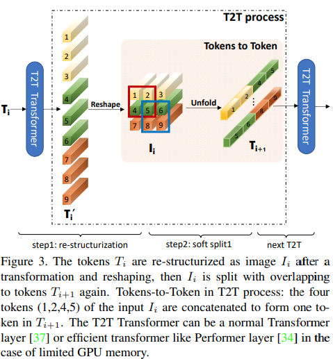</img>

<a href="https://arxiv.org/abs/2101.11986">This paper</a> proposes that the first couple layers should downsample the image sequence by unfolding, leading to overlapping image data in each token as shown in the figure above. You can use this variant of the `ViT` as follows.

```python
import torch
from vit_pytorch.t2t import T2TViT

v = T2TViT(
    dim = 512,
    image_size = 224,
    depth = 5,
    heads = 8,
    mlp_dim = 512,
    num_classes = 1000,
    t2t_layers = ((7, 4), (3, 2), (3, 2)) # tuples of the kernel size and stride of each consecutive layers of the initial token to token module
)

img = torch.randn(1, 3, 224, 224)

preds = v(img) # (1, 1000)
```

## CCT
</img>

<a href="https://arxiv.org/abs/2104.05704">CCT</a> proposes compact transformers
by using convolutions instead of patching and performing sequence pooling. This
allows for CCT to have high accuracy and a low number of parameters.

You can use this with two methods
```python
import torch
from vit_pytorch.cct import CCT

model = CCT(
        img_size=224,
        embedding_dim=384,
        n_conv_layers=2,
        kernel_size=7,
        stride=2,
        padding=3,
        pooling_kernel_size=3,
        pooling_stride=2,
        pooling_padding=1,
        num_layers=14,
        num_heads=6,
        mlp_radio=3.,
        num_classes=1000,
        positional_embedding='learnable', # ['sine', 'learnable', 'none']
        )
```

Alternatively you can use one of several pre-defined models `[2,4,6,7,8,14,16]`
which pre-define the number of layers, number of attention heads, the mlp ratio,
and the embedding dimension.

```python
import torch
from vit_pytorch.cct import cct_14

model = cct_14(
        img_size=224,
        n_conv_layers=1,
        kernel_size=7,
        stride=2,
        padding=3,
        pooling_kernel_size=3,
        pooling_stride=2,
        pooling_padding=1,
        num_classes=1000,
        positional_embedding='learnable', # ['sine', 'learnable', 'none']  
        )
```
<a href="https://github.com/SHI-Labs/Compact-Transformers">Official
Repository</a> includes links to pretrained model checkpoints.


## Cross ViT

</img>

<a href="https://arxiv.org/abs/2103.14899">This paper</a> proposes to have two vision transformers processing the image at different scales, cross attending to one every so often. They show improvements on top of the base vision transformer.

```python
import torch
from vit_pytorch.cross_vit import CrossViT

v = CrossViT(
    image_size = 256,
    num_classes = 1000,
    depth = 4,               # number of multi-scale encoding blocks
    sm_dim = 192,            # high res dimension
    sm_patch_size = 16,      # high res patch size (should be smaller than lg_patch_size)
    sm_enc_depth = 2,        # high res depth
    sm_enc_heads = 8,        # high res heads
    sm_enc_mlp_dim = 2048,   # high res feedforward dimension
    lg_dim = 384,            # low res dimension
    lg_patch_size = 64,      # low res patch size
    lg_enc_depth = 3,        # low res depth
    lg_enc_heads = 8,        # low res heads
    lg_enc_mlp_dim = 2048,   # low res feedforward dimensions
    cross_attn_depth = 2,    # cross attention rounds
    cross_attn_heads = 8,    # cross attention heads
    dropout = 0.1,
    emb_dropout = 0.1
)

img = torch.randn(1, 3, 256, 256)

pred = v(img) # (1, 1000)
```

## PiT

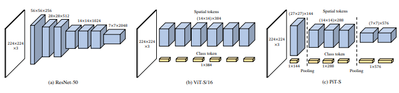</img>

<a href="https://arxiv.org/abs/2103.16302">This paper</a> proposes to downsample the tokens through a pooling procedure using depth-wise convolutions.

```python
import torch
from vit_pytorch.pit import PiT

v = PiT(
    image_size = 224,
    patch_size = 14,
    dim = 256,
    num_classes = 1000,
    depth = (3, 3, 3),     # list of depths, indicating the number of rounds of each stage before a downsample
    heads = 16,
    mlp_dim = 2048,
    dropout = 0.1,
    emb_dropout = 0.1
)

# forward pass now returns predictions and the attention maps

img = torch.randn(1, 3, 224, 224)

preds = v(img) # (1, 1000)
```

## LeViT

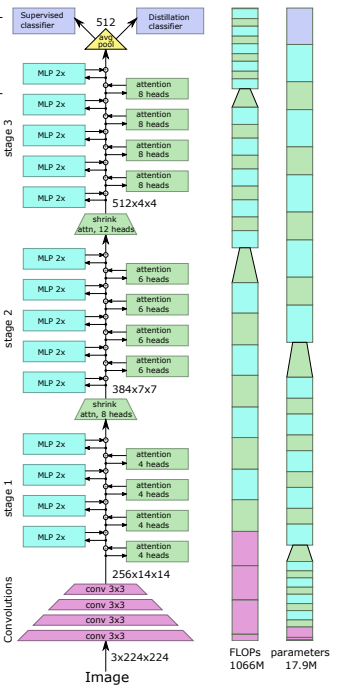</img>

<a href="https://arxiv.org/abs/2104.01136">This paper</a> proposes a number of changes, including (1) convolutional embedding instead of patch-wise projection (2) downsampling in stages (3) extra non-linearity in attention (4) 2d relative positional biases instead of initial absolute positional bias (5) batchnorm in place of layernorm.

<a href="https://github.com/facebookresearch/LeViT">Official repository</a>

```python
import torch
from vit_pytorch.levit import LeViT

levit = LeViT(
    image_size = 224,
    num_classes = 1000,
    stages = 3,             # number of stages
    dim = (256, 384, 512),  # dimensions at each stage
    depth = 4,              # transformer of depth 4 at each stage
    heads = (4, 6, 8),      # heads at each stage
    mlp_mult = 2,
    dropout = 0.1
)

img = torch.randn(1, 3, 224, 224)

levit(img) # (1, 1000)
```

## CvT

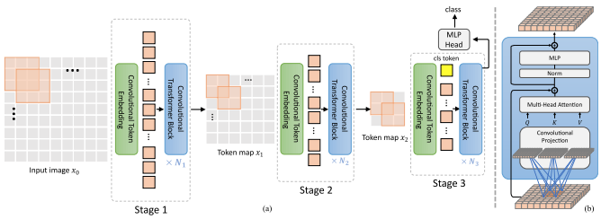</img>

<a href="https://arxiv.org/abs/2103.15808">This paper</a> proposes mixing convolutions and attention. Specifically, convolutions are used to embed and downsample the image / feature map in three stages. Depthwise-convoltion is also used to project the queries, keys, and values for attention.

```python
import torch
from vit_pytorch.cvt import CvT

v = CvT(
    num_classes = 1000,
    s1_emb_dim = 64,        # stage 1 - dimension
    s1_emb_kernel = 7,      # stage 1 - conv kernel
    s1_emb_stride = 4,      # stage 1 - conv stride
    s1_proj_kernel = 3,     # stage 1 - attention ds-conv kernel size
    s1_kv_proj_stride = 2,  # stage 1 - attention key / value projection stride
    s1_heads = 1,           # stage 1 - heads
    s1_depth = 1,           # stage 1 - depth
    s1_mlp_mult = 4,        # stage 1 - feedforward expansion factor
    s2_emb_dim = 192,       # stage 2 - (same as above)
    s2_emb_kernel = 3,
    s2_emb_stride = 2,
    s2_proj_kernel = 3,
    s2_kv_proj_stride = 2,
    s2_heads = 3,
    s2_depth = 2,
    s2_mlp_mult = 4,
    s3_emb_dim = 384,       # stage 3 - (same as above)
    s3_emb_kernel = 3,
    s3_emb_stride = 2,
    s3_proj_kernel = 3,
    s3_kv_proj_stride = 2,
    s3_heads = 4,
    s3_depth = 10,
    s3_mlp_mult = 4,
    dropout = 0.
)

img = torch.randn(1, 3, 224, 224)

pred = v(img) # (1, 1000)
```

## Twins SVT

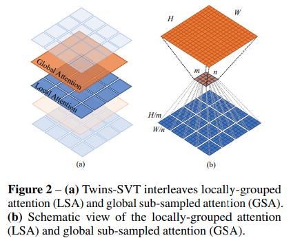</img>

This <a href="https://arxiv.org/abs/2104.13840">paper</a> proposes mixing local and global attention, along with position encoding generator (proposed in <a href="https://arxiv.org/abs/2102.10882">CPVT</a>) and global average pooling, to achieve the same results as <a href="https://arxiv.org/abs/2103.14030">Swin</a>, without the extra complexity of shifted windows, CLS tokens, nor positional embeddings.

```python
import torch
from vit_pytorch.twins_svt import TwinsSVT

model = TwinsSVT(
    num_classes = 1000,       # number of output classes
    s1_emb_dim = 64,          # stage 1 - patch embedding projected dimension
    s1_patch_size = 4,        # stage 1 - patch size for patch embedding
    s1_local_patch_size = 7,  # stage 1 - patch size for local attention
    s1_global_k = 7,          # stage 1 - global attention key / value reduction factor, defaults to 7 as specified in paper
    s1_depth = 1,             # stage 1 - number of transformer blocks (local attn -> ff -> global attn -> ff)
    s2_emb_dim = 128,         # stage 2 (same as above)
    s2_patch_size = 2,
    s2_local_patch_size = 7,
    s2_global_k = 7,
    s2_depth = 1,
    s3_emb_dim = 256,         # stage 3 (same as above)
    s3_patch_size = 2,
    s3_local_patch_size = 7,
    s3_global_k = 7,
    s3_depth = 5,
    s4_emb_dim = 512,         # stage 4 (same as above)
    s4_patch_size = 2,
    s4_local_patch_size = 7,
    s4_global_k = 7,
    s4_depth = 4,
    peg_kernel_size = 3,      # positional encoding generator kernel size
    dropout = 0.              # dropout
)

img = torch.randn(1, 3, 224, 224)

pred = model(img) # (1, 1000)
```

## RegionViT

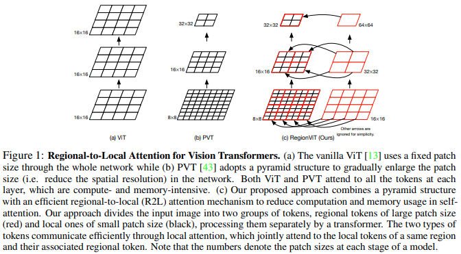</img>

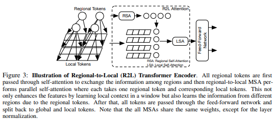</img>

<a href="https://arxiv.org/abs/2106.02689">This paper</a> proposes to divide up the feature map into local regions, whereby the local tokens attend to each other. Each local region has its own regional token which then attends to all its local tokens, as well as other regional tokens.

You can use it as follows

```python
import torch
from vit_pytorch.regionvit import RegionViT

model = RegionViT(
    dim = (64, 128, 256, 512),      # tuple of size 4, indicating dimension at each stage
    depth = (2, 2, 8, 2),           # depth of the region to local transformer at each stage
    window_size = 7,                # window size, which should be either 7 or 14
    num_classes = 1000,             # number of output classes
    tokenize_local_3_conv = False,  # whether to use a 3 layer convolution to encode the local tokens from the image. the paper uses this for the smaller models, but uses only 1 conv (set to False) for the larger models
    use_peg = False,                # whether to use positional generating module. they used this for object detection for a boost in performance
)

img = torch.randn(1, 3, 224, 224)

pred = model(img) # (1, 1000)
```

## CrossFormer

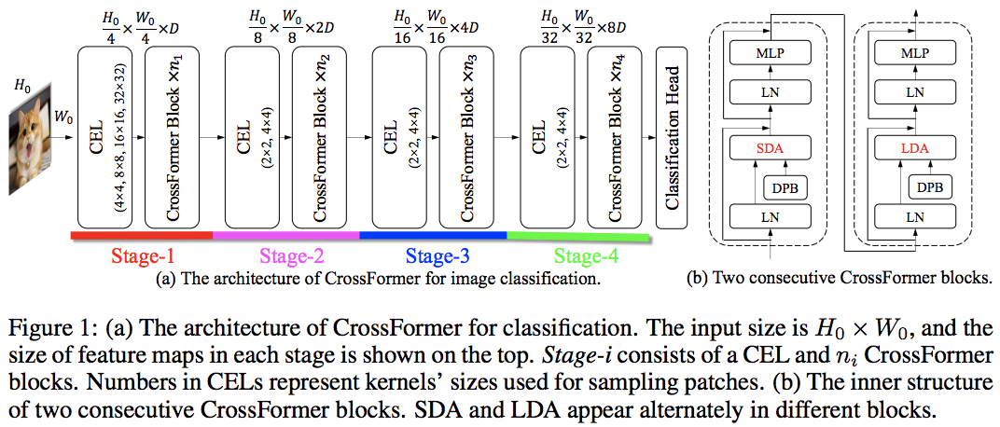</img>

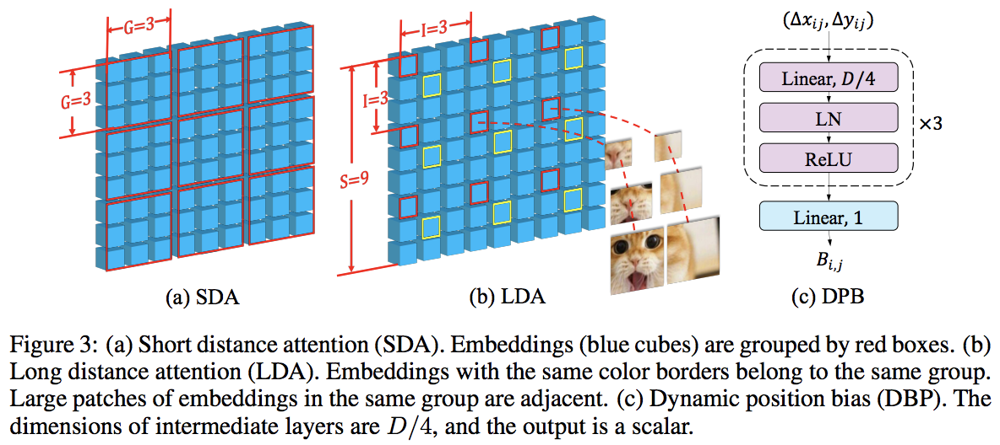</img>

This <a href="https://arxiv.org/abs/2108.00154">paper</a> beats PVT and Swin using alternating local and global attention. The global attention is done across the windowing dimension for reduced complexity, much like the scheme used for axial attention.

They also have cross-scale embedding layer, which they shown to be a generic layer that can improve all vision transformers. Dynamic relative positional bias was also formulated to allow the net to generalize to images of greater resolution.

```python
import torch
from vit_pytorch.crossformer import CrossFormer

model = CrossFormer(
    num_classes = 1000,                # number of output classes
    dim = (64, 128, 256, 512),         # dimension at each stage
    depth = (2, 2, 8, 2),              # depth of transformer at each stage
    global_window_size = (8, 4, 2, 1), # global window sizes at each stage
    local_window_size = 7,             # local window size (can be customized for each stage, but in paper, held constant at 7 for all stages)
)

img = torch.randn(1, 3, 224, 224)

pred = model(img) # (1, 1000)
```

## NesT

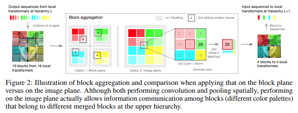</img>

This <a href="https://arxiv.org/abs/2105.12723">paper</a> decided to process the image in hierarchical stages, with attention only within tokens of local blocks, which aggregate as it moves up the heirarchy. The aggregation is done in the image plane, and contains a convolution and subsequent maxpool to allow it to pass information across the boundary.

You can use it with the following code (ex. NesT-T)

```python
import torch
from vit_pytorch.nest import NesT

nest = NesT(
    image_size = 224,
    patch_size = 4,
    dim = 96,
    heads = 3,
    num_hierarchies = 3,        # number of hierarchies
    block_repeats = (8, 4, 1),  # the number of transformer blocks at each heirarchy, starting from the bottom
    num_classes = 1000
)

img = torch.randn(1, 3, 224, 224)

pred = nest(img) # (1, 1000)
```

## MobileViT

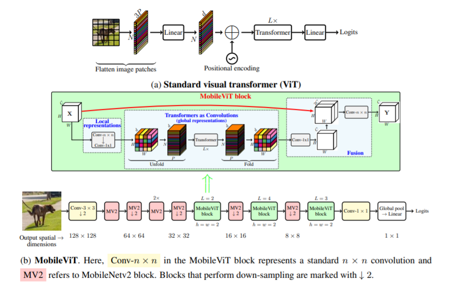</img>

This <a href="https://arxiv.org/abs/2110.02178">paper</a> introduce MobileViT, a light-weight and generalpurpose vision transformer for mobile devices. MobileViT presents a different
perspective for the global processing of information with transformers.

You can use it with the following code (ex. mobilevit_xs)

```
import torch
from vit_pytorch.mobile_vit import MobileViT

mbvit_xs = MobileViT(
    image_size=(256, 256),
    dims = [96, 120, 144],
    channels = [16, 32, 48, 48, 64, 64, 80, 80, 96, 96, 384],
    num_classes = 1000
)

img = torch.randn(1, 3, 256, 256)

pred = mbvit_xs(img) # (1, 1000)
```

## Simple Masked Image Modeling

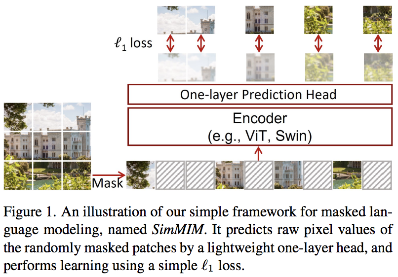

This <a href="https://arxiv.org/abs/2111.09886">paper</a> proposes a simple masked image modeling (SimMIM) scheme, using only a linear projection off the masked tokens into pixel space followed by an L1 loss with the pixel values of the masked patches. Results are competitive with other more complicated approaches.

You can use this as follows

```python
import torch
from vit_pytorch import ViT
from vit_pytorch.simmim import SimMIM

v = ViT(
    image_size = 256,
    patch_size = 32,
    num_classes = 1000,
    dim = 1024,
    depth = 6,
    heads = 8,
    mlp_dim = 2048
)

mim = SimMIM(
    encoder = v,
    masking_ratio = 0.5  # they found 50% to yield the best results
)

images = torch.randn(8, 3, 256, 256)

loss = mim(images)
loss.backward()

# that's all!
# do the above in a for loop many times with a lot of images and your vision transformer will learn

torch.save(v.state_dict(), './trained-vit.pt')
```


## Masked Autoencoder

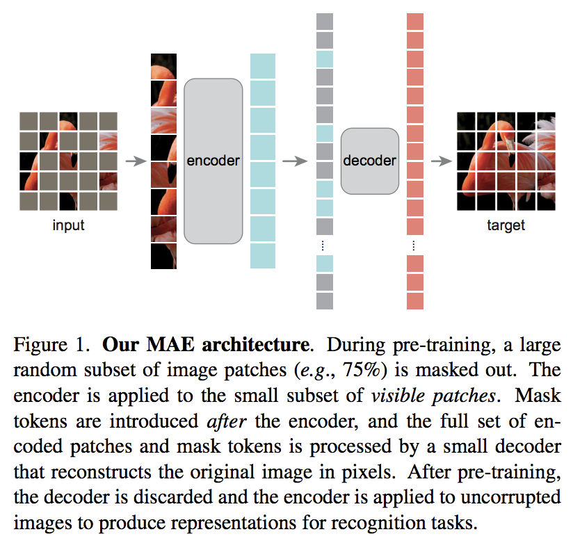

A new <a href="https://arxiv.org/abs/2111.06377">Kaiming He paper</a> proposes a simple autoencoder scheme where the vision transformer attends to a set of unmasked patches, and a smaller decoder tries to reconstruct the masked pixel values.

<a href="https://www.youtube.com/watch?v=LKixq2S2Pz8">DeepReader quick paper review</a>

<a href="https://www.youtube.com/watch?v=Dp6iICL2dVI">AI Coffeebreak with Letitia</a>

You can use it with the following code

```python
import torch
from vit_pytorch import ViT, MAE

v = ViT(
    image_size = 256,
    patch_size = 32,
    num_classes = 1000,
    dim = 1024,
    depth = 6,
    heads = 8,
    mlp_dim = 2048
)

mae = MAE(
    encoder = v,
    masking_ratio = 0.75,   # the paper recommended 75% masked patches
    decoder_dim = 512,      # paper showed good results with just 512
    decoder_depth = 6       # anywhere from 1 to 8
)

images = torch.randn(8, 3, 256, 256)

loss = mae(images)
loss.backward()

# that's all!
# do the above in a for loop many times with a lot of images and your vision transformer will learn

# save your improved vision transformer
torch.save(v.state_dict(), './trained-vit.pt')
```

## Masked Patch Prediction

Thanks to <a href="https://github.com/zankner">Zach</a>, you can train using the original masked patch prediction task presented in the paper, with the following code.

```python
import torch
from vit_pytorch import ViT
from vit_pytorch.mpp import MPP

model = ViT(
    image_size=256,
    patch_size=32,
    num_classes=1000,
    dim=1024,
    depth=6,
    heads=8,
    mlp_dim=2048,
    dropout=0.1,
    emb_dropout=0.1
)

mpp_trainer = MPP(
    transformer=model,
    patch_size=32,
    dim=1024,
    mask_prob=0.15,          # probability of using token in masked prediction task
    random_patch_prob=0.30,  # probability of randomly replacing a token being used for mpp
    replace_prob=0.50,       # probability of replacing a token being used for mpp with the mask token
)

opt = torch.optim.Adam(mpp_trainer.parameters(), lr=3e-4)

def sample_unlabelled_images():
    return torch.FloatTensor(20, 3, 256, 256).uniform_(0., 1.)

for _ in range(100):
    images = sample_unlabelled_images()
    loss = mpp_trainer(images)
    opt.zero_grad()
    loss.backward()
    opt.step()

# save your improved network
torch.save(model.state_dict(), './pretrained-net.pt')
```

## Adaptive Token Sampling

</img>

This <a href="https://arxiv.org/abs/2111.15667">paper</a> proposes to use the CLS attention scores, re-weighed by the norms of the value heads, as means to discard unimportant tokens at different layers.

```python
import torch
from vit_pytorch.ats_vit import ViT

v = ViT(
    image_size = 256,
    patch_size = 16,
    num_classes = 1000,
    dim = 1024,
    depth = 6,
    max_tokens_per_depth = (256, 128, 64, 32, 16, 8), # a tuple that denotes the maximum number of tokens that any given layer should have. if the layer has greater than this amount, it will undergo adaptive token sampling
    heads = 16,
    mlp_dim = 2048,
    dropout = 0.1,
    emb_dropout = 0.1
)

img = torch.randn(4, 3, 256, 256)

preds = v(img) # (1, 1000)

# you can also get a list of the final sampled patch ids
# a value of -1 denotes padding

preds, token_ids = v(img, return_sampled_token_ids = True) # (1, 1000), (1, <=8)
```

## Dino

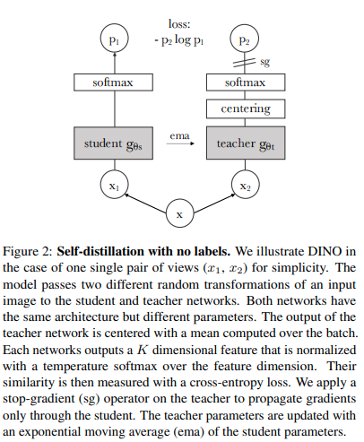</img>

You can train `ViT` with the recent SOTA self-supervised learning technique, <a href="https://arxiv.org/abs/2104.14294">Dino</a>, with the following code.

<a href="https://www.youtube.com/watch?v=h3ij3F3cPIk">Yannic Kilcher</a> video

```python
import torch
from vit_pytorch import ViT, Dino

model = ViT(
    image_size = 256,
    patch_size = 32,
    num_classes = 1000,
    dim = 1024,
    depth = 6,
    heads = 8,
    mlp_dim = 2048
)

learner = Dino(
    model,
    image_size = 256,
    hidden_layer = 'to_latent',        # hidden layer name or index, from which to extract the embedding
    projection_hidden_size = 256,      # projector network hidden dimension
    projection_layers = 4,             # number of layers in projection network
    num_classes_K = 65336,             # output logits dimensions (referenced as K in paper)
    student_temp = 0.9,                # student temperature
    teacher_temp = 0.04,               # teacher temperature, needs to be annealed from 0.04 to 0.07 over 30 epochs
    local_upper_crop_scale = 0.4,      # upper bound for local crop - 0.4 was recommended in the paper 
    global_lower_crop_scale = 0.5,     # lower bound for global crop - 0.5 was recommended in the paper
    moving_average_decay = 0.9,        # moving average of encoder - paper showed anywhere from 0.9 to 0.999 was ok
    center_moving_average_decay = 0.9, # moving average of teacher centers - paper showed anywhere from 0.9 to 0.999 was ok
)

opt = torch.optim.Adam(learner.parameters(), lr = 3e-4)

def sample_unlabelled_images():
    return torch.randn(20, 3, 256, 256)

for _ in range(100):
    images = sample_unlabelled_images()
    loss = learner(images)
    opt.zero_grad()
    loss.backward()
    opt.step()
    learner.update_moving_average() # update moving average of teacher encoder and teacher centers

# save your improved network
torch.save(model.state_dict(), './pretrained-net.pt')
```

## Accessing Attention

If you would like to visualize the attention weights (post-softmax) for your research, just follow the procedure below

```python
import torch
from vit_pytorch.vit import ViT

v = ViT(
    image_size = 256,
    patch_size = 32,
    num_classes = 1000,
    dim = 1024,
    depth = 6,
    heads = 16,
    mlp_dim = 2048,
    dropout = 0.1,
    emb_dropout = 0.1
)

# import Recorder and wrap the ViT

from vit_pytorch.recorder import Recorder
v = Recorder(v)

# forward pass now returns predictions and the attention maps

img = torch.randn(1, 3, 256, 256)
preds, attns = v(img)

# there is one extra patch due to the CLS token

attns # (1, 6, 16, 65, 65) - (batch x layers x heads x patch x patch)
```

to cleanup the class and the hooks once you have collected enough data

```python
v = v.eject()  # wrapper is discarded and original ViT instance is returned
```

## Research Ideas

### Efficient Attention

There may be some coming from computer vision who think attention still suffers from quadratic costs. Fortunately, we have a lot of new techniques that may help. This repository offers a way for you to plugin your own sparse attention transformer.

An example with <a href="https://arxiv.org/abs/2102.03902">Nystromformer</a>

```bash
$ pip install nystrom-attention
```

```python
import torch
from vit_pytorch.efficient import ViT
from nystrom_attention import Nystromformer

efficient_transformer = Nystromformer(
    dim = 512,
    depth = 12,
    heads = 8,
    num_landmarks = 256
)

v = ViT(
    dim = 512,
    image_size = 2048,
    patch_size = 32,
    num_classes = 1000,
    transformer = efficient_transformer
)

img = torch.randn(1, 3, 2048, 2048) # your high resolution picture
v(img) # (1, 1000)
```

Other sparse attention frameworks I would highly recommend is <a href="https://github.com/lucidrains/routing-transformer">Routing Transformer</a> or <a href="https://github.com/lucidrains/sinkhorn-transformer">Sinkhorn Transformer</a>

### Combining with other Transformer improvements

This paper purposely used the most vanilla of attention networks to make a statement. If you would like to use some of the latest improvements for attention nets, please use the `Encoder` from <a href="https://github.com/lucidrains/x-transformers">this repository</a>.

ex.

```bash
$ pip install x-transformers
```

```python
import torch
from vit_pytorch.efficient import ViT
from x_transformers import Encoder

v = ViT(
    dim = 512,
    image_size = 224,
    patch_size = 16,
    num_classes = 1000,
    transformer = Encoder(
        dim = 512,                  # set to be the same as the wrapper
        depth = 12,
        heads = 8,
        ff_glu = True,              # ex. feed forward GLU variant https://arxiv.org/abs/2002.05202
        residual_attn = True        # ex. residual attention https://arxiv.org/abs/2012.11747
    )
)

img = torch.randn(1, 3, 224, 224)
v(img) # (1, 1000)
```

## FAQ

- How do I pass in non-square images?

You can already pass in non-square images - you just have to make sure your height and width is less than or equal to the `image_size`, and both divisible by the `patch_size`

ex.

```python
import torch
from vit_pytorch import ViT

v = ViT(
    image_size = 256,
    patch_size = 32,
    num_classes = 1000,
    dim = 1024,
    depth = 6,
    heads = 16,
    mlp_dim = 2048,
    dropout = 0.1,
    emb_dropout = 0.1
)

img = torch.randn(1, 3, 256, 128) # <-- not a square

preds = v(img) # (1, 1000)
```

- How do I pass in non-square patches?

```python
import torch
from vit_pytorch import ViT

v = ViT(
    num_classes = 1000,
    image_size = (256, 128),  # image size is a tuple of (height, width)
    patch_size = (32, 16),    # patch size is a tuple of (height, width)
    dim = 1024,
    depth = 6,
    heads = 16,
    mlp_dim = 2048,
    dropout = 0.1,
    emb_dropout = 0.1
)

img = torch.randn(1, 3, 256, 128)

preds = v(img)
```

## Resources

Coming from computer vision and new to transformers? Here are some resources that greatly accelerated my learning.

1. <a href="http://jalammar.github.io/illustrated-transformer/">Illustrated Transformer</a> - Jay Alammar

2. <a href="http://peterbloem.nl/blog/transformers">Transformers from Scratch</a>  - Peter Bloem

3. <a href="https://nlp.seas.harvard.edu/2018/04/03/attention.html">The Annotated Transformer</a> - Harvard NLP


## Citations
```bibtex
@article{hassani2021escaping,
    title   = {Escaping the Big Data Paradigm with Compact Transformers},
    author  = {Ali Hassani and Steven Walton and Nikhil Shah and Abulikemu Abuduweili and Jiachen Li and Humphrey Shi},
    year    = 2021,
    url     = {https://arxiv.org/abs/2104.05704},
    eprint  = {2104.05704},
    archiveprefix = {arXiv},
    primaryclass = {cs.CV}
}
```

```bibtex
@misc{dosovitskiy2020image,
    title   = {An Image is Worth 16x16 Words: Transformers for Image Recognition at Scale},
    author  = {Alexey Dosovitskiy and Lucas Beyer and Alexander Kolesnikov and Dirk Weissenborn and Xiaohua Zhai and Thomas Unterthiner and Mostafa Dehghani and Matthias Minderer and Georg Heigold and Sylvain Gelly and Jakob Uszkoreit and Neil Houlsby},
    year    = {2020},
    eprint  = {2010.11929},
    archivePrefix = {arXiv},
    primaryClass = {cs.CV}
}
```

```bibtex
@misc{touvron2020training,
    title   = {Training data-efficient image transformers & distillation through attention}, 
    author  = {Hugo Touvron and Matthieu Cord and Matthijs Douze and Francisco Massa and Alexandre Sablayrolles and Hervé Jégou},
    year    = {2020},
    eprint  = {2012.12877},
    archivePrefix = {arXiv},
    primaryClass = {cs.CV}
}
```

```bibtex
@misc{yuan2021tokenstotoken,
    title   = {Tokens-to-Token ViT: Training Vision Transformers from Scratch on ImageNet},
    author  = {Li Yuan and Yunpeng Chen and Tao Wang and Weihao Yu and Yujun Shi and Francis EH Tay and Jiashi Feng and Shuicheng Yan},
    year    = {2021},
    eprint  = {2101.11986},
    archivePrefix = {arXiv},
    primaryClass = {cs.CV}
}
```

```bibtex
@misc{zhou2021deepvit,
    title   = {DeepViT: Towards Deeper Vision Transformer},
    author  = {Daquan Zhou and Bingyi Kang and Xiaojie Jin and Linjie Yang and Xiaochen Lian and Qibin Hou and Jiashi Feng},
    year    = {2021},
    eprint  = {2103.11886},
    archivePrefix = {arXiv},
    primaryClass = {cs.CV}
}
```

```bibtex
@misc{touvron2021going,
    title   = {Going deeper with Image Transformers}, 
    author  = {Hugo Touvron and Matthieu Cord and Alexandre Sablayrolles and Gabriel Synnaeve and Hervé Jégou},
    year    = {2021},
    eprint  = {2103.17239},
    archivePrefix = {arXiv},
    primaryClass = {cs.CV}
}
```

```bibtex
@misc{chen2021crossvit,
    title   = {CrossViT: Cross-Attention Multi-Scale Vision Transformer for Image Classification},
    author  = {Chun-Fu Chen and Quanfu Fan and Rameswar Panda},
    year    = {2021},
    eprint  = {2103.14899},
    archivePrefix = {arXiv},
    primaryClass = {cs.CV}
}
```

```bibtex
@misc{wu2021cvt,
    title   = {CvT: Introducing Convolutions to Vision Transformers},
    author  = {Haiping Wu and Bin Xiao and Noel Codella and Mengchen Liu and Xiyang Dai and Lu Yuan and Lei Zhang},
    year    = {2021},
    eprint  = {2103.15808},
    archivePrefix = {arXiv},
    primaryClass = {cs.CV}
}
```

```bibtex
@misc{heo2021rethinking,
    title   = {Rethinking Spatial Dimensions of Vision Transformers}, 
    author  = {Byeongho Heo and Sangdoo Yun and Dongyoon Han and Sanghyuk Chun and Junsuk Choe and Seong Joon Oh},
    year    = {2021},
    eprint  = {2103.16302},
    archivePrefix = {arXiv},
    primaryClass = {cs.CV}
}
```

```bibtex
@misc{graham2021levit,
    title   = {LeViT: a Vision Transformer in ConvNet's Clothing for Faster Inference},
    author  = {Ben Graham and Alaaeldin El-Nouby and Hugo Touvron and Pierre Stock and Armand Joulin and Hervé Jégou and Matthijs Douze},
    year    = {2021},
    eprint  = {2104.01136},
    archivePrefix = {arXiv},
    primaryClass = {cs.CV}
}
```

```bibtex
@misc{li2021localvit,
    title   = {LocalViT: Bringing Locality to Vision Transformers},
    author  = {Yawei Li and Kai Zhang and Jiezhang Cao and Radu Timofte and Luc Van Gool},
    year    = {2021},
    eprint  = {2104.05707},
    archivePrefix = {arXiv},
    primaryClass = {cs.CV}
}
```

```bibtex
@misc{chu2021twins,
    title   = {Twins: Revisiting Spatial Attention Design in Vision Transformers},
    author  = {Xiangxiang Chu and Zhi Tian and Yuqing Wang and Bo Zhang and Haibing Ren and Xiaolin Wei and Huaxia Xia and Chunhua Shen},
    year    = {2021},
    eprint  = {2104.13840},
    archivePrefix = {arXiv},
    primaryClass = {cs.CV}
}
```

```bibtex
@misc{su2021roformer,
    title   = {RoFormer: Enhanced Transformer with Rotary Position Embedding}, 
    author  = {Jianlin Su and Yu Lu and Shengfeng Pan and Bo Wen and Yunfeng Liu},
    year    = {2021},
    eprint  = {2104.09864},
    archivePrefix = {arXiv},
    primaryClass = {cs.CL}
}
```

```bibtex
@misc{zhang2021aggregating,
    title   = {Aggregating Nested Transformers},
    author  = {Zizhao Zhang and Han Zhang and Long Zhao and Ting Chen and Tomas Pfister},
    year    = {2021},
    eprint  = {2105.12723},
    archivePrefix = {arXiv},
    primaryClass = {cs.CV}
}
```

```bibtex
@misc{chen2021regionvit,
    title   = {RegionViT: Regional-to-Local Attention for Vision Transformers}, 
    author  = {Chun-Fu Chen and Rameswar Panda and Quanfu Fan},
    year    = {2021},
    eprint  = {2106.02689},
    archivePrefix = {arXiv},
    primaryClass = {cs.CV}
}
```

```bibtex
@misc{wang2021crossformer,
    title   = {CrossFormer: A Versatile Vision Transformer Hinging on Cross-scale Attention}, 
    author  = {Wenxiao Wang and Lu Yao and Long Chen and Binbin Lin and Deng Cai and Xiaofei He and Wei Liu},
    year    = {2021},
    eprint  = {2108.00154},
    archivePrefix = {arXiv},
    primaryClass = {cs.CV}
}
```

```bibtex
@misc{caron2021emerging,
    title   = {Emerging Properties in Self-Supervised Vision Transformers},
    author  = {Mathilde Caron and Hugo Touvron and Ishan Misra and Hervé Jégou and Julien Mairal and Piotr Bojanowski and Armand Joulin},
    year    = {2021},
    eprint  = {2104.14294},
    archivePrefix = {arXiv},
    primaryClass = {cs.CV}
}
```

```bibtex
@misc{he2021masked,
    title   = {Masked Autoencoders Are Scalable Vision Learners}, 
    author  = {Kaiming He and Xinlei Chen and Saining Xie and Yanghao Li and Piotr Dollár and Ross Girshick},
    year    = {2021},
    eprint  = {2111.06377},
    archivePrefix = {arXiv},
    primaryClass = {cs.CV}
}
```

```bibtex
@misc{xie2021simmim,
    title   = {SimMIM: A Simple Framework for Masked Image Modeling}, 
    author  = {Zhenda Xie and Zheng Zhang and Yue Cao and Yutong Lin and Jianmin Bao and Zhuliang Yao and Qi Dai and Han Hu},
    year    = {2021},
    eprint  = {2111.09886},
    archivePrefix = {arXiv},
    primaryClass = {cs.CV}
}
```

```bibtex
@misc{fayyaz2021ats,
    title   = {ATS: Adaptive Token Sampling For Efficient Vision Transformers},
    author  = {Mohsen Fayyaz and Soroush Abbasi Kouhpayegani and Farnoush Rezaei Jafari and Eric Sommerlade and Hamid Reza Vaezi Joze and Hamed Pirsiavash and Juergen Gall},
    year    = {2021},
    eprint  = {2111.15667},
    archivePrefix = {arXiv},
    primaryClass = {cs.CV}
}
```

```bibtex
@misc{vaswani2017attention,
    title   = {Attention Is All You Need},
    author  = {Ashish Vaswani and Noam Shazeer and Niki Parmar and Jakob Uszkoreit and Llion Jones and Aidan N. Gomez and Lukasz Kaiser and Illia Polosukhin},
    year    = {2017},
    eprint  = {1706.03762},
    archivePrefix = {arXiv},
    primaryClass = {cs.CL}
}
```

*I visualise a time when we will be to robots what dogs are to humans, and I’m rooting for the machines.* — Claude Shannon
