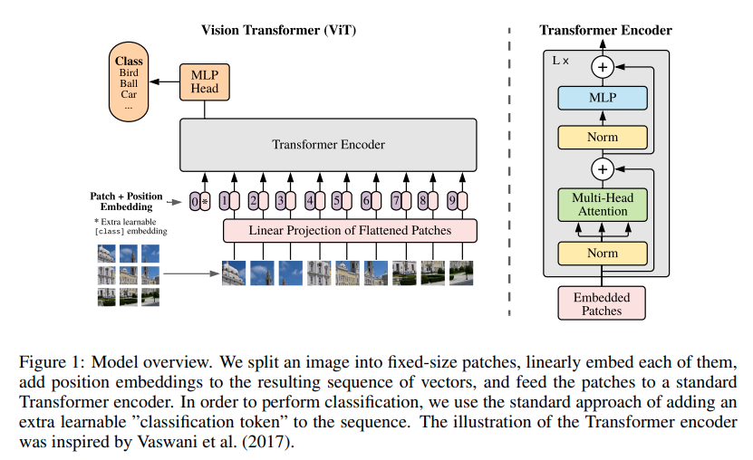

</img>

## Vision Transformer - Pytorch

Implementation of <a href="https://openreview.net/pdf?id=YicbFdNTTy">Vision Transformer</a>, a simple way to achieve SOTA in vision classification with only a single transformer encoder, in Pytorch. Significance is further explained in <a href="https://www.youtube.com/watch?v=TrdevFK_am4">Yannic Kilcher's</a> video. There's really not much to code here, but may as well lay it out for everyone so we expedite the attention revolution.

## Install

```bash
$ pip install vit-pytorch
```

## Usage

```python
import torch
from vit_pytorch import ViT

v = ViT(
    image_size = 256,
    patch_size = 32,
    num_classes = 1000,
    dim = 1024,
    depth = 6,
    heads = 8,
    mlp_dim = 2048
)

img = torch.randn(1, 3, 256, 256)
mask = torch.ones(1, 8, 8).bool() # optional mask, designating which patch to attend to

preds = v(img, mask = mask) # (1, 1000)
```

## Research Ideas

### Self Supervised Training

You can train this with a near SOTA self-supervised learning technique, <a href="https://github.com/lucidrains/byol-pytorch">BYOL</a>, with the following code.

(1)
```bash
$ pip install byol-pytorch
```

(2)
```python
import torch
from vit_pytorch import ViT
from byol_pytorch import BYOL

model = ViT(
    image_size = 256,
    patch_size = 32,
    num_classes = 1000,
    dim = 1024,
    depth = 6,
    heads = 8,
    mlp_dim = 2048
)

learner = BYOL(
    model,
    image_size = 256,
    hidden_layer = 'to_cls_token'
)

opt = torch.optim.Adam(learner.parameters(), lr=3e-4)

def sample_unlabelled_images():
    return torch.randn(20, 3, 256, 256)

for _ in range(100):
    images = sample_unlabelled_images()
    loss = learner(images)
    opt.zero_grad()
    loss.backward()
    opt.step()
    learner.update_moving_average() # update moving average of target encoder

# save your improved network
torch.save(model.state_dict(), './pretrained-net.pt')
```

A pytorch-lightning script is ready for you to use at the repository link above.

### Efficient Attention

There may be some coming from computer vision who think attention still suffers from quadratic costs. Fortunately, we have a lot of new techniques that may help. This repository offers a way for you to plugin your own sparse attention transformer.

An example with <a href="https://arxiv.org/abs/2006.04768">Linformer</a>

```bash
$ pip install linformer
```

```python
import torch
from vit_pytorch.efficient import ViT
from linformer import Linformer

efficient_transformer = Linformer(
    dim = 512,
    seq_len = 4096 + 1,  # 64 x 64 patches + 1 cls token
    depth = 12,
    heads = 8,
    k = 256
)

v = ViT(
    dim = 512,
    image_size = 2048,
    patch_size = 32,
    num_classes = 1000,
    transformer = efficient_transformer
)

img = torch.randn(1, 3, 2048, 2048) # your high resolution picture
v(img) # (1, 1000)
```

Other sparse attention frameworks I would highly recommend is <a href="https://github.com/lucidrains/routing-transformer">Routing Transformer</a> or <a href="https://github.com/lucidrains/sinkhorn-transformer">Sinkhorn Transformer</a>

## Citations

```bibtex
@inproceedings{
    anonymous2021an,
    title={An Image is Worth 16x16 Words: Transformers for Image Recognition at Scale},
    author={Anonymous},
    booktitle={Submitted to International Conference on Learning Representations},
    year={2021},
    url={https://openreview.net/forum?id=YicbFdNTTy},
    note={under review}
}
```
