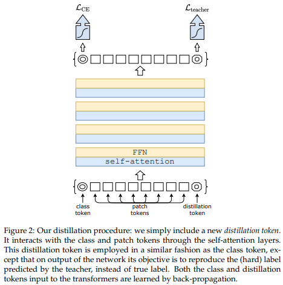

</img>

## Vision Transformer - Pytorch

Implementation of <a href="https://openreview.net/pdf?id=YicbFdNTTy">Vision Transformer</a>, a simple way to achieve SOTA in vision classification with only a single transformer encoder, in Pytorch. Significance is further explained in <a href="https://www.youtube.com/watch?v=TrdevFK_am4">Yannic Kilcher's</a> video. There's really not much to code here, but may as well lay it out for everyone so we expedite the attention revolution.

For a Pytorch implementation with pretrained models, please see Ross Wightman's repository <a href="https://github.com/rwightman/pytorch-image-models">here</a>.

The official Jax repository is <a href="https://github.com/google-research/vision_transformer">here</a>.

## Install

```bash
$ pip install vit-pytorch
```

## Usage

```python
import torch
from vit_pytorch import ViT

v = ViT(
    image_size = 256,
    patch_size = 32,
    num_classes = 1000,
    dim = 1024,
    depth = 6,
    heads = 16,
    mlp_dim = 2048,
    dropout = 0.1,
    emb_dropout = 0.1
)

img = torch.randn(1, 3, 256, 256)
mask = torch.ones(1, 8, 8).bool() # optional mask, designating which patch to attend to

preds = v(img, mask = mask) # (1, 1000)
```

## Parameters
- `image_size`: int.  
Image size. If you have rectangular images, make sure your image size is the maximum of the width and height
- `patch_size`: int.  
Number of patches. `image_size` must be divisible by `patch_size`.  
The number of patches is: ` n = (image_size // patch_size) ** 2` and `n` **must be greater than 16**.
- `num_classes`: int.  
Number of classes to classify.
- `dim`: int.  
Last dimension of output tensor after linear transformation `nn.Linear(..., dim)`.
- `depth`: int.  
Number of Transformer blocks.
- `heads`: int.  
Number of heads in Multi-head Attention layer. 
- `mlp_dim`: int.  
Dimension of the MLP (FeedForward) layer. 
- `channels`: int, default `3`.  
Number of image's channels. 
- `dropout`: float between `[0, 1]`, default `0.`.  
Dropout rate. 
- `emb_dropout`: float between `[0, 1]`, default `0`.  
Embedding dropout rate.
- `pool`: string, either `cls` token pooling or `mean` pooling

## Distillation

</img>

A recent <a href="https://arxiv.org/abs/2012.12877">paper</a> has shown that use of a distillation token for distilling knowledge from convolutional nets to vision transformer can yield small and efficient vision transformers. This repository offers the means to do distillation easily.

ex. distilling from Resnet50 (or any teacher) to a vision transformer

```python
import torch
from torchvision.models import resnet50

from vit_pytorch.distill import DistillableViT, DistillWrapper

teacher = resnet50(pretrained = True)

v = DistillableViT(
    image_size = 256,
    patch_size = 32,
    num_classes = 1000,
    dim = 1024,
    depth = 6,
    heads = 8,
    mlp_dim = 2048,
    dropout = 0.1,
    emb_dropout = 0.1
)

distiller = DistillWrapper(
    student = v,
    teacher = teacher,
    temperature = 3,           # temperature of distillation
    alpha = 0.5                # trade between main loss and distillation loss
)

img = torch.randn(2, 3, 256, 256)
labels = torch.randint(0, 1000, (2,))

loss = distiller(img, labels)
loss.backward()

# after lots of training above ...

pred = v(img) # (2, 1000)
```

The `DistillableViT` class is identical to `ViT` except for how the forward pass is handled, so you should be able to load the parameters back to `ViT` after you have completed distillation training.

You can also use the handy `.to_vit` method on the `DistillableViT` instance to get back a `ViT` instance.

```python
v = v.to_vit()
type(v) # <class 'vit_pytorch.vit_pytorch.ViT'>
```

## Research Ideas

### Self Supervised Training

You can train this with a near SOTA self-supervised learning technique, <a href="https://github.com/lucidrains/byol-pytorch">BYOL</a>, with the following code.

(1)
```bash
$ pip install byol-pytorch
```

(2)
```python
import torch
from vit_pytorch import ViT
from byol_pytorch import BYOL

model = ViT(
    image_size = 256,
    patch_size = 32,
    num_classes = 1000,
    dim = 1024,
    depth = 6,
    heads = 8,
    mlp_dim = 2048
)

learner = BYOL(
    model,
    image_size = 256,
    hidden_layer = 'to_latent'
)

opt = torch.optim.Adam(learner.parameters(), lr=3e-4)

def sample_unlabelled_images():
    return torch.randn(20, 3, 256, 256)

for _ in range(100):
    images = sample_unlabelled_images()
    loss = learner(images)
    opt.zero_grad()
    loss.backward()
    opt.step()
    learner.update_moving_average() # update moving average of target encoder

# save your improved network
torch.save(model.state_dict(), './pretrained-net.pt')
```

A pytorch-lightning script is ready for you to use at the repository link above.

### Efficient Attention

There may be some coming from computer vision who think attention still suffers from quadratic costs. Fortunately, we have a lot of new techniques that may help. This repository offers a way for you to plugin your own sparse attention transformer.

An example with <a href="https://arxiv.org/abs/2006.04768">Linformer</a>

```bash
$ pip install linformer
```

```python
import torch
from vit_pytorch.efficient import ViT
from linformer import Linformer

efficient_transformer = Linformer(
    dim = 512,
    seq_len = 4096 + 1,  # 64 x 64 patches + 1 cls token
    depth = 12,
    heads = 8,
    k = 256
)

v = ViT(
    dim = 512,
    image_size = 2048,
    patch_size = 32,
    num_classes = 1000,
    transformer = efficient_transformer
)

img = torch.randn(1, 3, 2048, 2048) # your high resolution picture
v(img) # (1, 1000)
```

Other sparse attention frameworks I would highly recommend is <a href="https://github.com/lucidrains/routing-transformer">Routing Transformer</a> or <a href="https://github.com/lucidrains/sinkhorn-transformer">Sinkhorn Transformer</a>

### Combining with other Transformer improvements

This paper purposely used the most vanilla of attention networks to make a statement. If you would like to use some of the latest improvements for attention nets, please use the `Encoder` from <a href="https://github.com/lucidrains/x-transformers">this repository</a>.

ex.

```bash
$ pip install x-transformers
```

```python
import torch
from vit_pytorch.efficient import ViT
from x_transformers import Encoder

v = ViT(
    dim = 512,
    image_size = 224,
    patch_size = 16,
    num_classes = 1000,
    transformer = Encoder(
        dim = 512,                  # set to be the same as the wrapper
        depth = 12,
        heads = 8,
        ff_glu = True,              # ex. feed forward GLU variant https://arxiv.org/abs/2002.05202
        residual_attn = True        # ex. residual attention https://arxiv.org/abs/2012.11747
    )
)

img = torch.randn(1, 3, 224, 224)
v(img) # (1, 1000)
```

## Resources

Coming from computer vision and new to transformers? Here are some resources that greatly accelerated my learning.

1. <a href="http://jalammar.github.io/illustrated-transformer/">Illustrated Transformer</a> - Jay Alammar

2. <a href="http://peterbloem.nl/blog/transformers">Transformers from Scratch</a>  - Peter Bloem

3. <a href="https://nlp.seas.harvard.edu/2018/04/03/attention.html">The Annotated Transformer</a> - Harvard NLP


## Citations

```bibtex
@misc{dosovitskiy2020image,
    title   = {An Image is Worth 16x16 Words: Transformers for Image Recognition at Scale},
    author  = {Alexey Dosovitskiy and Lucas Beyer and Alexander Kolesnikov and Dirk Weissenborn and Xiaohua Zhai and Thomas Unterthiner and Mostafa Dehghani and Matthias Minderer and Georg Heigold and Sylvain Gelly and Jakob Uszkoreit and Neil Houlsby},
    year    = {2020},
    eprint  = {2010.11929},
    archivePrefix = {arXiv},
    primaryClass = {cs.CV}
}
```

```bibtex
@misc{touvron2020training,
    title   = {Training data-efficient image transformers & distillation through attention}, 
    author  = {Hugo Touvron and Matthieu Cord and Matthijs Douze and Francisco Massa and Alexandre Sablayrolles and Hervé Jégou},
    year    = {2020},
    eprint  = {2012.12877},
    archivePrefix = {arXiv},
    primaryClass = {cs.CV}
}
```

```bibtex
@misc{vaswani2017attention,
    title   = {Attention Is All You Need},
    author  = {Ashish Vaswani and Noam Shazeer and Niki Parmar and Jakob Uszkoreit and Llion Jones and Aidan N. Gomez and Lukasz Kaiser and Illia Polosukhin},
    year    = {2017},
    eprint  = {1706.03762},
    archivePrefix = {arXiv},
    primaryClass = {cs.CL}
}
```

*I visualise a time when we will be to robots what dogs are to humans, and I’m rooting for the machines.* — Claude Shannon
